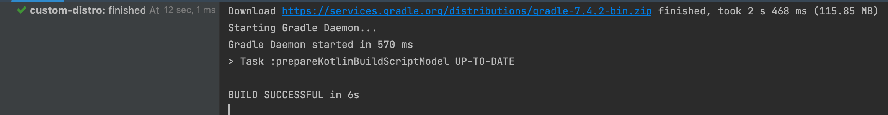
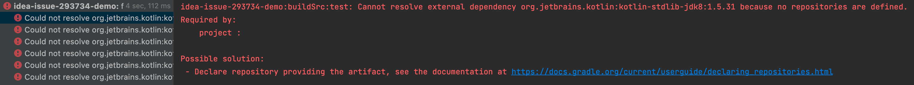

Demo project to reproduce IDEA issue with Gradle Custom Distributions and `buildSrc` support, failing to pickup `init.d` scripts.

https://youtrack.jetbrains.com/issue/IDEA-293734/IDEA-runs-Gradle-Sync-for-buildSrc-for-on-the-wrong-daemon-when-

The custom `setup.init.gradle.kts` adds a default `mavenLocal()` repository

Reproduction steps, from a Terminal located at this repo do:
1) Build the custom distribution: `custom-distro/gradlew -p custom-distro build`
2) Check the main test project builds fine:
   1) Stop all daemons by running `./gradlew --stop`
   2) Delete your Gradle distributions cache by running `rm -rf ~/.gradle/wrapper/dists/` to ensure a fresh copy of them (downloads are cached)
   3) Run `./gradlew build`
3) Reproduce the issue:
   1) Stop all daemons by running `./gradlew --stop`
   2) Ensure IDEA is not running (no process)
   3) Open `custom-distro` with IDEA as a standalone project (not the root, but from child folder): 
   This project has a standard Gradle URI on its own `gradle-wrapper.properties` and it will leave a "regular" Gradle daemon running after a Sync
   4) While keeping `custom-distro` open, also open the main test project with IDEA
   5) A Gradle Sync will start and later fail: 
```
> Configure project :buildSrc
build: buildSrc
gradleHomeDir: /Users/gmazzola/.gradle/wrapper/dists/gradle-7.4.2-bin/48ivgl02cpt2ed3fh9dbalvx8/gradle-7.4.2
initScripts:
- /Users/gmazzola/.gradle/wrapper/dists/custom-gradle-7.4.2/1fd6fseo4lschh0u6x0b4kmd1/gradle-7.4.2/init.d/setup.init.gradle.kts

> Task :buildSrc:generateExternalPluginSpecBuilders UP-TO-DATE
> Task :buildSrc:extractPrecompiledScriptPluginPlugins UP-TO-DATE
> Task :buildSrc:compilePluginsBlocks UP-TO-DATE
> Task :buildSrc:generatePrecompiledScriptPluginAccessors UP-TO-DATE
> Task :buildSrc:generateScriptPluginAdapters UP-TO-DATE
> Task :buildSrc:compileKotlin UP-TO-DATE
> Task :buildSrc:compileJava NO-SOURCE
> Task :buildSrc:compileGroovy NO-SOURCE
> Task :buildSrc:pluginDescriptors UP-TO-DATE
> Task :buildSrc:processResources UP-TO-DATE
> Task :buildSrc:classes UP-TO-DATE
> Task :buildSrc:inspectClassesForKotlinIC UP-TO-DATE
> Task :buildSrc:jar UP-TO-DATE
> Task :buildSrc:assemble UP-TO-DATE
> Task :buildSrc:compileTestKotlin NO-SOURCE
> Task :buildSrc:pluginUnderTestMetadata UP-TO-DATE
> Task :buildSrc:compileTestJava NO-SOURCE
> Task :buildSrc:compileTestGroovy NO-SOURCE
> Task :buildSrc:processTestResources NO-SOURCE
> Task :buildSrc:testClasses UP-TO-DATE
> Task :buildSrc:test NO-SOURCE
> Task :buildSrc:validatePlugins UP-TO-DATE
> Task :buildSrc:check UP-TO-DATE
> Task :buildSrc:build UP-TO-DATE

> Configure project :
build: idea-issue-293734-demo
gradleHomeDir: /Users/gmazzola/.gradle/wrapper/dists/gradle-7.4.2-bin/48ivgl02cpt2ed3fh9dbalvx8/gradle-7.4.2
initScripts:
- /private/var/folders/zw/rjr1swbj1slfmj83gc9chf800000gp/T/ijmapper.gradle
- /private/var/folders/zw/rjr1swbj1slfmj83gc9chf800000gp/T/sync.studio.tooling5531.gradle
- /private/var/folders/zw/rjr1swbj1slfmj83gc9chf800000gp/T/ijinit.gradle
- /private/var/folders/zw/rjr1swbj1slfmj83gc9chf800000gp/T/ijtestinit.gradle
- /Users/gmazzola/.gradle/wrapper/dists/custom-gradle-7.4.2/1fd6fseo4lschh0u6x0b4kmd1/gradle-7.4.2/init.d/setup.init.gradle.kts

> Task :prepareKotlinBuildScriptModel UP-TO-DATE

BUILD SUCCESSFUL in 1s
12 actionable tasks: 12 up-to-date

> Configure project :
build: buildSrc
gradleHomeDir: /Users/gmazzola/.gradle/wrapper/dists/gradle-7.4.2-bin/48ivgl02cpt2ed3fh9dbalvx8/gradle-7.4.2
initScripts:
- /private/var/folders/zw/rjr1swbj1slfmj83gc9chf800000gp/T/ijmapper.gradle
- /private/var/folders/zw/rjr1swbj1slfmj83gc9chf800000gp/T/ijmapper.gradle
- /private/var/folders/zw/rjr1swbj1slfmj83gc9chf800000gp/T/sync.studio.tooling5531.gradle
- /private/var/folders/zw/rjr1swbj1slfmj83gc9chf800000gp/T/ijinit.gradle
- /private/var/folders/zw/rjr1swbj1slfmj83gc9chf800000gp/T/sync.studio.tooling6171.gradle
- /private/var/folders/zw/rjr1swbj1slfmj83gc9chf800000gp/T/ijinit1.gradle
- /private/var/folders/zw/rjr1swbj1slfmj83gc9chf800000gp/T/ijtestinit.gradle

> Task :prepareKotlinBuildScriptModel UP-TO-DATE
Could not resolve: org.jetbrains.kotlin:kotlin-stdlib-jdk8:1.5.31
Could not resolve: org.jetbrains.kotlin:kotlin-reflect:1.5.31
Could not resolve: org.jetbrains.kotlin:kotlin-gradle-plugin:1.5.31
Could not resolve: org.jetbrains.kotlin:kotlin-stdlib-jdk8:1.5.31
Could not resolve: org.jetbrains.kotlin:kotlin-reflect:1.5.31
Could not resolve: org.jetbrains.kotlin:kotlin-gradle-plugin:1.5.31

BUILD SUCCESSFUL in 421ms
```

As you can see in the logs, there is a third "special" build that runs `:prepareKotlinBuildScriptModel` under `buildSrc`, and the `setup.init.gradle.kts` is not there